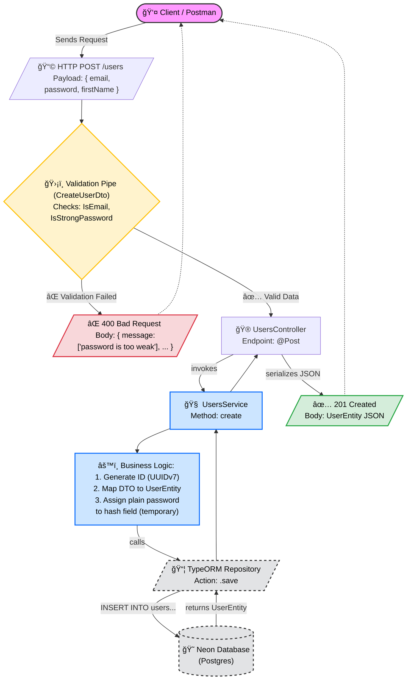

# Fit Tracker Backend API

### User Registration Flow

```mermaid
	flowchart TD
    %% Global Styles
    classDef client fill:#f9f,stroke:#333,stroke-width:2px,color:black;
    classDef validator fill:#fff3cd,stroke:#ffc107,stroke-width:2px,color:black;
    classDef error fill:#f8d7da,stroke:#dc3545,stroke-width:2px,color:black;
    classDef success fill:#d4edda,stroke:#28a745,stroke-width:2px,color:black;
    classDef logic fill:#cce5ff,stroke:#0d6efd,stroke-width:2px,color:black;
    classDef db fill:#e2e3e5,stroke:#333,stroke-width:2px,stroke-dasharray: 5 5,color:black;

    %% Nodes
    Client([👤 Client / Postman]):::client
    
    Request[/"📩 HTTP POST /users <br/> Payload: { email, password, firstName }"/]
    
    Validation{"ğŸ›¡ï¸ Validation Pipe <br/> (CreateUserDto) <br/> Checks: IsEmail, IsStrongPassword"}:::validator
    
    Err400[/"⌠400 Bad Request <br/> Body: { message: ['password is too weak'], ... }"/]:::error
    
    Controller[🮠UsersController <br/> Endpoint: @Post]
    
    Service[🧠 UsersService <br/> Method: create]:::logic
    
    BusinessLogic["âš™ï¸ Business Logic: <br/> 1. Generate ID (UUIDv7) <br/> 2. Map DTO to UserEntity <br/> 3. Assign plain password to hash field (temporary)"]:::logic
    
    Repo[/"📦 TypeORM Repository <br/> Action: .save"/]:::db
    
    DB[("😠Neon Database <br/> (Postgres)")]:::db
    
    Response[/"✅ 201 Created <br/> Body: UserEntity JSON"/]:::success

    %% Connections
    Client -->|Sends Request| Request
    Request --> Validation
    
    Validation -- "⌠Validation Failed" --> Err400
    Err400 -.-> Client
    
    Validation -- "✅ Valid Data" --> Controller
    Controller -->|"invokes"| Service
    
    Service --> BusinessLogic
    BusinessLogic -->|"calls"| Repo
    Repo -->|"INSERT INTO users..."| DB
    
    DB -- "returns UserEntity" --> Repo
    Repo --> Service
    Service --> Controller
    Controller -->|"serializes JSON"| Response
    Response -.-> Client
```
